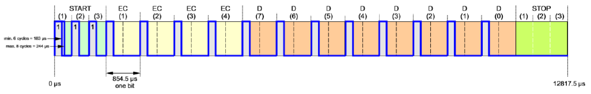
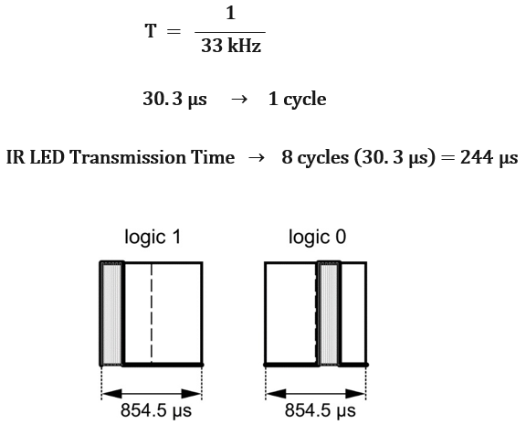

# HP-48GX-Infrarred-Signal-Decoder

The HP 48 is a series of graphing calculators capable of communicate with a wireless printer via infrared signals. The protocol used by these calculators, called "Rey Eye", operates in a frequency of 33 kHz. This project aims to replicate a program that runs in an HP 48GX to read an electronic people counter. Reading the counters with a calculator is not practical, and therefore a specific device should be built for this task. To construct such device the project was divided into three parts.

First, the signals emitted by the calculator's program were decoded with an IR sensor conneceted to an oscilloscope and then replicated with an Atmega328p. After decoding the infrared signals, the results were examined to understand better the protocol. This examination provided the required information to code a program capable of reading the infrared signals. Finally, to implement the emitter and receiver code in a functional device, a PCB board was designed.

Although this project focuses on a specific program to read electronic people counter, it can be used as a starting point for others since the communication protocol is the same for all applications.

## Red Eye Protocol

The Red Eye Frame is composed of 15 bits:

* 1.5 start bits.   
* 4 error bits.
* 8 data bits.
* 1.5 stop bits.

Generally, the length of each bit within the frame is 854.5 us, but this value could vary depend on the IR sensor implemented. It is advisable to test with an oscilloscope the output of the sesor before making any assumptions. The logic level of one bit is defined by the position of a high state within the pulse. The high state takes 244 us, time in which the IR Led is switching on and off every 15.15 us (one cycle 30.3 us).

## Software

* Atmel Studio 6.0 - Integrated Development Platform for developing and debugging AVR microcontrollers.
* Eagle PCB Design - PCB layout and schematic design software

## License

This project is licensed under the MIT License - see the [LICENSE.md](LICENSE.md) file for details
